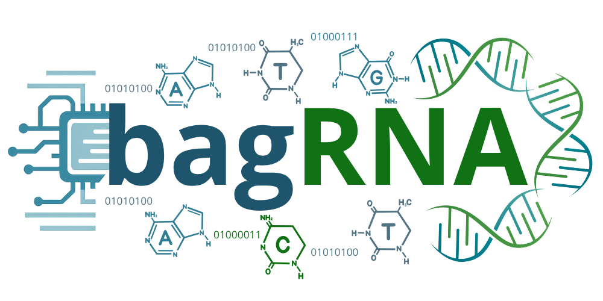
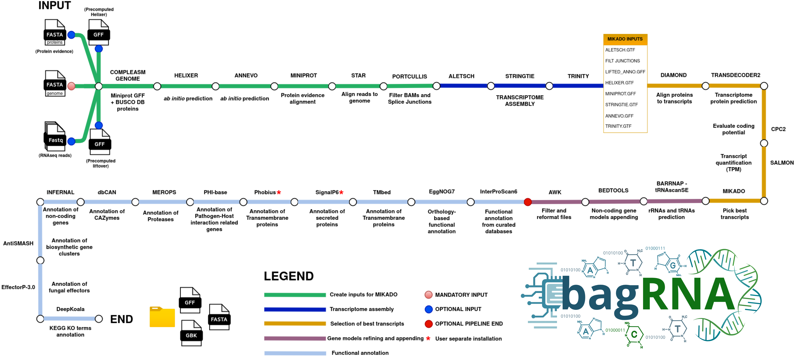

A Nextflow DSL2 pipeline for end-to-end eukaryotic genome annotation. It integrates RNA-seq evidence, ab initio gene predictors, structural annotation, and functional annotation into a single reproducible workflow, with all steps running in Docker containers.



## Requirements

- [Nextflow](https://www.nextflow.io/) `>=25.04.6,<26`
- Java 21 (e.g. `openjdk-21-jre-headless`)
- Docker
- (optional) an NVIDIA GPU + [NVIDIA Container Toolkit](https://docs.nvidia.com/datacenter/cloud-native/container-toolkit/latest/install-guide.html) for `--use_gpu` (Helixer, ANNEVO, TransDecoder2, InterProScan6 SignalP/TMBed)

```bash
export NXF_VER=25.04.6
export JAVA_HOME=/usr/lib/jvm/java-21-openjdk-amd64   # adjust to your Java 21 install
```

## What it does

**Structural annotation** (`workflows/structural_annotation.nf`, ~25 steps):

1. Genome QC — BUSCO/compleasm genome mode
2. Ab initio predictions — Helixer (GPU, optional) and ANNEVO (GPU)
3. Protein-to-genome alignment — Miniprot
4. RNA-seq alignment — STAR (all samples in one run via a manifest, RG-tagged)
5. Splice-junction filtering — Portcullis
6. Transcript assembly — Aletsch, StringTie (± long reads), genome-guided Trinity
7. Evidence integration — Mikado prepare, DIAMOND, TransDecoder2, CPC2, Salmon
8. Gene model selection — Mikado serialise/pick (fungal-tuned scoring in `assets/fungi.yaml`)
9. Post-processing — coding-model filtering, renaming, rRNA/tRNA detection, merging
10. Final cleanup — AGAT filtering, GFF cleanup, table2asn, protein/ncRNA extraction

**Functional annotation** (`workflows/functional_annotation.nf`): InterProScan6, eggNOG-mapper, KEGG Orthology (DeepKOALA), Rfam, SignalP, dbCAN, MEROPS, PHI-base, antiSMASH, and a self-contained HTML/PDF annotation report.

## Quick start

**1. Download databases (one-time setup):**

```bash
nextflow run main.nf -entry SETUP --db_dir /path/to/databases
```

**2. Full annotation (structural + functional):**

```bash
nextflow run main.nf \
    --genome_fasta genome.fa \
    --prot_evidence proteins.faa \
    --busco_lineage sordariomycetes \
    --star_manifest star_manifest.tsv \
    --species "Genus_species" \
    --submission_template template.sbt \
    --databases /path/to/databases \
    --IPS6_databases_path /path/to/ips6_databases \
    --outdir results \
    -resume
```

`--star_manifest` is a TSV of `R1.fastq.gz<TAB>R2.fastq.gz<TAB>condition`, one line per sample.

**3. Functional annotation only** (starting from an existing protein set):

```bash
nextflow run main.nf \
    --functional_anno_only \
    --genome_fasta genome.fa \
    --protein_fasta proteins.faa \
    --species "Genus_species" \
    --submission_template template.sbt \
    --databases /path/to/databases \
    --IPS6_databases_path /path/to/ips6_databases
```

**Resuming a run** — add `-resume` with the same parameters. Never edit files under `workflows/`, `modules/`, or `subworkflows/` between resumed runs of the same pipeline instance: Nextflow fingerprints process definitions, and any change invalidates the cache for every downstream process. Process-level overrides (resources, container mounts) belong in `nextflow.config` under `withName:` blocks instead.

See `nextflow run main.nf --help` and `nextflow_schema.json` for the full parameter list, or run `nextflow_schema.json` through any [nf-core/nf-validation](https://nextflow-io.github.io/nf-validation/) compatible parameter tool.

## Configuration notes

- **GPU steps** (`--use_gpu`) require the NVIDIA Container Toolkit; Helixer, ANNEVO, and TransDecoder2 use it when requested, DeepKOALA uses it opportunistically only if `--use_gpu` is set elsewhere in the run.
- **Extra Docker volume mounts:** a few processes (`RUN_DBCAN`, `TRANSDECODER2_PFAM_SCAN`, `EGGNOG`) mount an extra host path (`/mnt/newvolume` in `nextflow.config`) so Docker can follow symlinks when large databases live on a separate volume/mount from the working directory. If your databases live under the working directory already, these mounts are harmless no-ops; otherwise edit the `containerOptions` in the corresponding `withName:` block in `nextflow.config` to point at wherever your databases actually live.
- **Resource sizing:** `process_high`/`process_gpu`/`process_long` labels default to (physical RAM − 4 GB); override with `--max_memory` if your Docker daemon has a lower memory limit than the host.
- **Execution profiles:** `-profile standard` (default, local executor), `-profile slurm`, `-profile sge` for cluster execution.

## Repository layout

```
main.nf                    Entry point: validation, channel construction, workflow dispatch
nextflow.config             Params, process resource labels, Docker settings, execution profiles
nextflow_schema.json        Machine-readable parameter schema
workflows/
  structural_annotation.nf  Genome + RNA-seq -> gene models
  functional_annotation.nf  Gene models -> functional annotation
  download_databases.nf     -entry SETUP: downloads all reference databases
modules/                    One Nextflow process per file
subworkflows/interproscan6/ InterProScan6 sub-pipeline (per-member-database containers)
assets/                     Mikado scoring YAML, static reference tables, sentinel file
bin/                        Helper scripts (Python/Perl/Groovy) invoked from process scripts
lib/                        Groovy/Java dependencies used by the InterProScan6 subworkflow
docker/                     Dockerfiles for custom images (eggNOG-mapper, TransDecoder2, DeepKOALA, report generator)
```

## License

MIT — see [LICENSE](LICENSE).
